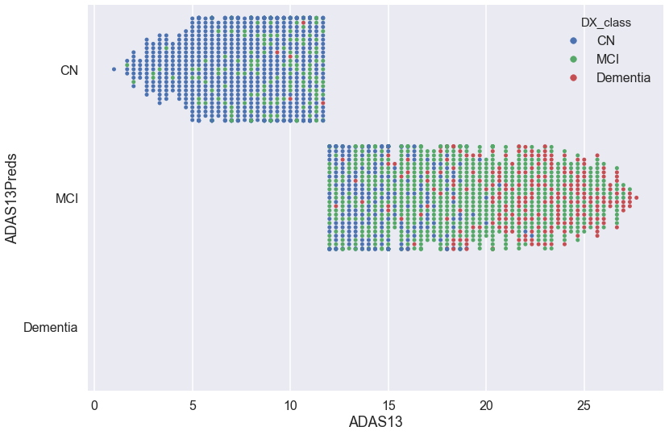

## Contents
{:.no_toc}
*  
{: toc}

## Modeling Approach and Project Trajectory 

1. The Longitudinal nature of the data was not accounted for. This meant removing all ‘baseline’ measures and treating each row as a unique data point. The way we dealt with missing values was imputation with medians, which was mentioned in class as the most effective way of dealing with missingness. The Diagnosis column (DX) was an ordinal variable, and it was accordingly dealt with by mapping values to 0-2. Other categorical variables were one-hot encoded.
2. The next step was to run regressions using each cognitive test as a response variable and the rest of the features (including DX) as predictors. This ensured the we are predicting how well a certain test correlates with the other tests, given the diagnosis. 
3. We then used the R2 scores for each regression to decide which model is the best. Initially we thought that there would be a clear winner both in terms of the diagnostic test as well as the regression model. But on running the models, there were three combinations of test + model that offered comparable performances – ADAS11 (Random Forest), ECogPT (Linear Regression, RidgeCV, and Random Forest) and ECogSP (Linear Regression, RidgeCV, and Random Forest). First we checked the tests for any correlation, since that may have caused the close results. After making a pairplot and heatmap, we realised the tests weren’t sufficiently correlated and we would need to find a way to account for the separate tests. We then decided to create a combined meta-score using these seven test + model predicted scores, weighting each predicted score with the R-squared value, using the following formula:

    **Combined Score = S $R^2$*(Predicted Score)**

    This was a major change in the way we expected to construct the meta-test, and we had to take a decision based on our mathematical understanding of these models about how to weight the score of each test. We were also referencing the literature on Characterizing Alzheimer's disease using a hypometabolic convergence index (HCI), which helped us in formulating our meta-indicator.

4. Added the predictions of the best model as a new column(‘meta test’)
5. We then ran a classification using DX values as the classes and the ‘meta test’ as a predictor. Here we ran a number of classification models to determine which gave the best classification accuracy. Out of 4 models (AdaBoost, Logistic Regression, Random Forest Classifier, and Logistic Regression with quadratic terms), Adaboost proved to give the best results. **The classification accuracy rates were .66, .84, and .69 for CN, MCI, and Dementia, respectively. This far out performs a base classifier based on random chance alone.**
6. The results of the classification were then used to show where the classification boundaries are along the scale of the ‘meta test’. While doing this classification, we realised that while our meta-score was reasonably adept at handling the classification of CN and ‘Dementia’, the MCI category was still messy. This meant that there was a lot of ‘bleeding’ into MCI both from the ‘CN’ class and the ‘Dementia’ class. This was problematic, especially on the CN-MCI side, because if a patient actually has MCI and is diagnosed as ‘Cognitively Normal’, no further tests might be conducted. On the Alzheimer’s side, it is still a problem, but the stakes are perhaps not as high. Therefore a need was identified to conducted an additional layer of tests.
7. The range for which MCI was messy was for the meta-test score between 10 and 25. As mentioned, there was considerable bleeding into MCI from both ‘CN’ and ‘Dementia’. We had expected to see some of this on the basis of our initial EDA. We needed to make a decision on how to resolve this issue. The following steps describe the technique we adopted:
  - We queried the full-set for all data-points where our test scored in that range and then re-ran the initial regression to generate an R2 matrix to determine if there were any new tests that performed much better on this filtered range, and indeed ADAS13 emerged as a new test that performed better than other tests specifically on this messy MCI range, and it hadn’t surfaced earlier on the entire dataset.
  - We then reran the classification with Adaboost to see if the MCI class was better classified now, and ADAS13 was indeed showing a better classification accuracy.
  - Based on the ADAS13 score, we were able to identify the second layer of classification categories  (see figure below)
8. We finally generated the dataset with the predicted classifications.


<br/> <br/>
## Implementation


```python
import pandas as pd
import numpy as np
import seaborn as sns
import matplotlib
import matplotlib.pyplot as plt
from sklearn.ensemble import RandomForestClassifier, RandomForestRegressor 
from sklearn.tree import DecisionTreeClassifier, DecisionTreeRegressor
from sklearn.linear_model import LinearRegression, LogisticRegression,LogisticRegressionCV, LassoCV, RidgeCV
from sklearn.neighbors import KNeighborsRegressor
from sklearn.preprocessing import PolynomialFeatures
from sklearn.decomposition import PCA

%matplotlib inline
```


First, we have decided to ignore longitudinal data and treat each row as a unique patient. This means we need to take out any 'baseline' data.


```python
df = pd.read_csv('ADNIMERGE.csv')
all_cols = list(df)

important_cols = [i for i in all_cols[9:-3] if i[-2:] != 'bl']
important_cols = ['RID'] + important_cols
data = df[important_cols].copy()
```


`AGE` is probably an important predictor for a diagnosis. However, ADNIMERGE_DICT says that `AGE` is the age of the patient at baseline. Because we are treating each row as a separate patient, we should use `Month_bl` (months from baseline) to calculate a 'new age' for each row. That is, a 65 year old who gets a second exam 12 months later will be treated as a different, 66 year old person.


```python
data['EXACT_AGE'] = df.AGE + (df.Month_bl/12)
```


```python

DX_class = []
for i in data.DX.values:
    if i == 'CN':
        DX_class.append(0)
    elif i == 'MCI':
        DX_class.append(1)
    elif i == 'Dementia':
        DX_class.append(2)
    else:
        DX_class.append(i) # for NaNs. will deal with missingness next.

data.drop('DX',axis=1,inplace=True)

data['DX_class'] = DX_class
```


```python
cat_cols = [i for i in data.columns if isinstance(data[i][0], str)]

data_hot = pd.get_dummies(data, columns = cat_cols, drop_first = True)

data_hot.shape
```


    (13017, 54)


Now we need to deal with missingness.


```python
def percent_in_each_col(df):
    percent_missing = [df[i].isnull().mean()*100 for i in list(df)]
    percent_missing = np.asarray(percent_missing)
    in_each = pd.DataFrame(percent_missing,df.columns,columns=["Percent"])
    print(in_each[in_each.Percent > 0])
    print("Average percent missing for all columns: ", in_each[in_each.Percent > 0].mean())

percent_in_each_col(data_hot)
```


                             Percent
    APOE4                   0.453253
    FDG                    74.241377
    PIB                    98.286856
    AV45                   83.398633
    CDRSB                  30.736729
    ADAS11                 31.174618
    ADAS13                 31.835292
    MMSE                   29.522932
    RAVLT_immediate        30.383345
    RAVLT_learning         30.383345
    RAVLT_forgetting       30.583084
    RAVLT_perc_forgetting  31.120842
    FAQ                    29.000538
    MOCA                   60.052239
    EcogPtMem              59.360836
    EcogPtLang             59.483752
    EcogPtVisspat          59.798725
    EcogPtPlan             59.560575
    EcogPtOrgan            60.382577
    EcogPtDivatt           59.798725
    EcogPtTotal            59.453023
    EcogSPMem              59.099639
    EcogSPLang             59.061228
    EcogSPVisspat          59.829454
    EcogSPPlan             59.545210
    EcogSPOrgan            60.866559
    EcogSPDivatt           60.121380
    EcogSPTotal            59.099639
    Ventricles             42.790197
    Hippocampus            47.729892
    WholeBrain             40.915726
    Entorhinal             50.295767
    Fusiform               50.295767
    MidTemp                50.295767
    ICV                    38.887609
    DX_class               31.251440
    Average percent missing for all columns:  Percent    49.419349
    dtype: float64


Some of the features have more than 50% of the data missing. This is because some tests were not used during certain protocols (ADNI1 vs ADNIGO, for example). Not sure exactly how to deal with that. Right now, we're just going to impute values for all the missing data, and see where that gets us.


```python
percent_in_each_col(data_hot)
```


                             Percent
    APOE4                   0.453253
    FDG                    74.241377
    PIB                    98.286856
    AV45                   83.398633
    CDRSB                  30.736729
    ADAS11                 31.174618
    ADAS13                 31.835292
    MMSE                   29.522932
    RAVLT_immediate        30.383345
    RAVLT_learning         30.383345
    RAVLT_forgetting       30.583084
    RAVLT_perc_forgetting  31.120842
    FAQ                    29.000538
    MOCA                   60.052239
    EcogPtMem              59.360836
    EcogPtLang             59.483752
    EcogPtVisspat          59.798725
    EcogPtPlan             59.560575
    EcogPtOrgan            60.382577
    EcogPtDivatt           59.798725
    EcogPtTotal            59.453023
    EcogSPMem              59.099639
    EcogSPLang             59.061228
    EcogSPVisspat          59.829454
    EcogSPPlan             59.545210
    EcogSPOrgan            60.866559
    EcogSPDivatt           60.121380
    EcogSPTotal            59.099639
    Ventricles             42.790197
    Hippocampus            47.729892
    WholeBrain             40.915726
    Entorhinal             50.295767
    Fusiform               50.295767
    MidTemp                50.295767
    ICV                    38.887609
    DX_class               31.251440
    Average percent missing for all columns:  Percent    49.419349
    dtype: float64


```python

from sklearn.preprocessing import Imputer

imp = Imputer(strategy="median")
imputed = imp.fit_transform(data_hot)
full_data = pd.DataFrame(imputed,columns = data_hot.columns)

percent_in_each_col(full_data)
```


    Empty DataFrame
    Columns: [Percent]
    Index: []
    Average percent missing for all columns:  Percent   NaN
    dtype: float64


```python
full_data.head()
```


<div>
<style>
    .dataframe thead tr:only-child th {
        text-align: right;
    }
    
    .dataframe thead th {
        text-align: left;
    }
    
    .dataframe tbody tr th {
        vertical-align: top;
    }
</style>
<table border="1" class="dataframe">
  <thead>
    <tr style="text-align: right;">
      <th></th>
      <th>RID</th>
      <th>PTEDUCAT</th>
      <th>APOE4</th>
      <th>FDG</th>
      <th>PIB</th>
      <th>AV45</th>
      <th>CDRSB</th>
      <th>ADAS11</th>
      <th>ADAS13</th>
      <th>MMSE</th>
      <th>...</th>
      <th>PTRACCAT_Hawaiian/Other PI</th>
      <th>PTRACCAT_More than one</th>
      <th>PTRACCAT_Unknown</th>
      <th>PTRACCAT_White</th>
      <th>PTMARRY_Married</th>
      <th>PTMARRY_Never married</th>
      <th>PTMARRY_Unknown</th>
      <th>PTMARRY_Widowed</th>
      <th>FLDSTRENG_3 Tesla MRI</th>
      <th>FSVERSION_Cross-Sectional FreeSurfer (FreeSurfer Version 4.3)</th>
    </tr>
  </thead>
  <tbody>
    <tr>
      <th>0</th>
      <td>2.0</td>
      <td>16.0</td>
      <td>0.0</td>
      <td>1.36926</td>
      <td>1.85</td>
      <td>1.11467</td>
      <td>0.0</td>
      <td>10.67</td>
      <td>18.67</td>
      <td>28.0</td>
      <td>...</td>
      <td>0.0</td>
      <td>0.0</td>
      <td>0.0</td>
      <td>1.0</td>
      <td>1.0</td>
      <td>0.0</td>
      <td>0.0</td>
      <td>0.0</td>
      <td>0.0</td>
      <td>1.0</td>
    </tr>
    <tr>
      <th>1</th>
      <td>3.0</td>
      <td>18.0</td>
      <td>1.0</td>
      <td>1.09079</td>
      <td>1.85</td>
      <td>1.11467</td>
      <td>4.5</td>
      <td>22.00</td>
      <td>31.00</td>
      <td>20.0</td>
      <td>...</td>
      <td>0.0</td>
      <td>0.0</td>
      <td>0.0</td>
      <td>1.0</td>
      <td>1.0</td>
      <td>0.0</td>
      <td>0.0</td>
      <td>0.0</td>
      <td>0.0</td>
      <td>1.0</td>
    </tr>
    <tr>
      <th>2</th>
      <td>3.0</td>
      <td>18.0</td>
      <td>1.0</td>
      <td>1.06360</td>
      <td>1.85</td>
      <td>1.11467</td>
      <td>6.0</td>
      <td>19.00</td>
      <td>30.00</td>
      <td>24.0</td>
      <td>...</td>
      <td>0.0</td>
      <td>0.0</td>
      <td>0.0</td>
      <td>1.0</td>
      <td>1.0</td>
      <td>0.0</td>
      <td>0.0</td>
      <td>0.0</td>
      <td>0.0</td>
      <td>1.0</td>
    </tr>
    <tr>
      <th>3</th>
      <td>3.0</td>
      <td>18.0</td>
      <td>1.0</td>
      <td>1.10384</td>
      <td>1.85</td>
      <td>1.11467</td>
      <td>3.5</td>
      <td>24.00</td>
      <td>35.00</td>
      <td>17.0</td>
      <td>...</td>
      <td>0.0</td>
      <td>0.0</td>
      <td>0.0</td>
      <td>1.0</td>
      <td>1.0</td>
      <td>0.0</td>
      <td>0.0</td>
      <td>0.0</td>
      <td>0.0</td>
      <td>1.0</td>
    </tr>
    <tr>
      <th>4</th>
      <td>3.0</td>
      <td>18.0</td>
      <td>1.0</td>
      <td>1.03871</td>
      <td>1.85</td>
      <td>1.11467</td>
      <td>8.0</td>
      <td>25.67</td>
      <td>37.67</td>
      <td>19.0</td>
      <td>...</td>
      <td>0.0</td>
      <td>0.0</td>
      <td>0.0</td>
      <td>1.0</td>
      <td>1.0</td>
      <td>0.0</td>
      <td>0.0</td>
      <td>0.0</td>
      <td>0.0</td>
      <td>1.0</td>
    </tr>
  </tbody>
</table>
<p>5 rows × 54 columns</p>
</div>


Now, we want to run a few different types of regressions on this 'full' data set using each cognitive test as a response variable. We'll create a matrix of R^2 values, and use that to decide which models should contribute to our 'meta test'.


```python
def split_and_score(df, response_col_name, model):
    # returns TEST score based on model fitted to data with specified response var
    # response_col_name is a string
    # model is an unfitted sklearn model
    # would be nice to add a polynomial features option
    np.random.seed(9001)
    msk = np.random.rand(len(df)) < .75
    
    train = df[msk]
    test = df[~msk]
        
    predictors = [i for i in df.columns[1:] if i not in response_col_name]
    x = train[predictors]
    y = train[response_col_name]
    
    Xt = test[predictors]
    yt = test[response_col_name]        
    
    model.fit(x,y)
    test_score = model.score(Xt, yt)
    return test_score 
```


```python
def make_score_df(df,response_vars,model_dict):
    # returns a dataframes of TEST r^2 values
    # response_vars is a list of strings
    # model_dict is a dictionary of unfitted sklearn models
    
    keys = list(model_dict.keys())
    scores = np.zeros((len(response_vars),len(keys)))
    
    for col, model in enumerate(keys):
        for row, response in enumerate(response_vars):
            scores[row,col] = split_and_score(df,response,model_dict[model])
   
    score_df = pd.DataFrame(scores,columns=[keys],index=response_vars)

    return score_df
```


```python
cog_tests = ['ADAS13','CDRSB','MOCA','MMSE','RAVLT_perc_forgetting','FAQ','ADAS11',"EcogPtTotal",'EcogSPTotal']

models = {}
models['KNN'] = KNeighborsRegressor(n_neighbors = 25)
models['LinearRegression'] = LinearRegression(fit_intercept = True)
models['Ridge'] = RidgeCV()
models['Lasso'] = LassoCV()
models['RandomForest'] = RandomForestRegressor()
models['DecisionTree'] = DecisionTreeRegressor()
```


```python
score_df = make_score_df(full_data,cog_tests,models)

sns.set_context("poster")
score_df.plot(kind="bar")
```


    <matplotlib.axes._subplots.AxesSubplot at 0x119170080>


```python
score_df
```


<div>
<style>
    .dataframe thead tr:only-child th {
        text-align: right;
    }
    
    .dataframe thead th {
        text-align: left;
    }
    
    .dataframe tbody tr th {
        vertical-align: top;
    }
</style>
<table border="1" class="dataframe">
  <thead>
    <tr style="text-align: right;">
      <th></th>
      <th>KNN</th>
      <th>LinearRegression</th>
      <th>Ridge</th>
      <th>Lasso</th>
      <th>RandomForest</th>
      <th>DecisionTree</th>
    </tr>
  </thead>
  <tbody>
    <tr>
      <th>ADAS13</th>
      <td>0.370575</td>
      <td>0.920684</td>
      <td>0.920670</td>
      <td>0.249385</td>
      <td>0.927926</td>
      <td>0.889698</td>
    </tr>
    <tr>
      <th>CDRSB</th>
      <td>0.461899</td>
      <td>0.788965</td>
      <td>0.788952</td>
      <td>0.165541</td>
      <td>0.827817</td>
      <td>0.677024</td>
    </tr>
    <tr>
      <th>MOCA</th>
      <td>0.197120</td>
      <td>0.493442</td>
      <td>0.493475</td>
      <td>0.007704</td>
      <td>0.638813</td>
      <td>0.408791</td>
    </tr>
    <tr>
      <th>MMSE</th>
      <td>0.351756</td>
      <td>0.684854</td>
      <td>0.684950</td>
      <td>0.190285</td>
      <td>0.686197</td>
      <td>0.492026</td>
    </tr>
    <tr>
      <th>RAVLT_perc_forgetting</th>
      <td>0.035105</td>
      <td>0.325546</td>
      <td>0.324882</td>
      <td>0.036130</td>
      <td>0.345215</td>
      <td>0.361106</td>
    </tr>
    <tr>
      <th>FAQ</th>
      <td>0.405214</td>
      <td>0.783359</td>
      <td>0.783136</td>
      <td>0.187249</td>
      <td>0.829880</td>
      <td>0.716532</td>
    </tr>
    <tr>
      <th>ADAS11</th>
      <td>0.367270</td>
      <td>0.919964</td>
      <td>0.920025</td>
      <td>0.219364</td>
      <td>0.947112</td>
      <td>0.933235</td>
    </tr>
    <tr>
      <th>EcogPtTotal</th>
      <td>0.062392</td>
      <td>0.994702</td>
      <td>0.994683</td>
      <td>-0.000713</td>
      <td>0.982113</td>
      <td>0.947330</td>
    </tr>
    <tr>
      <th>EcogSPTotal</th>
      <td>0.287788</td>
      <td>0.996034</td>
      <td>0.996000</td>
      <td>-0.000169</td>
      <td>0.992946</td>
      <td>0.978392</td>
    </tr>
  </tbody>
</table>
</div>


Now, were are going to combine the test/model pairings with the best $R^2$ scores into one 'meta test'. Those pairings are:

- EcogPtTotal, Linear Regression
- EcogPtTotal, RidgeCV
- EcogPtTotal, RandomForest
- EcogSPTotal, Linear Regression
- EcogSPTotal, RidgeCV
- EcogSPTotal, RandomForest
- ADAS11, RandomForest

We'll refit and predict each model, then create a linear combination of the seven predictions, weighting each by its $R^2$ score.


```python

def create_meta_test(df,model,response):
    # create subset to fit on
    np.random.seed(9001)
    msk = np.random.rand(len(df)) < .5
    small = df[msk]
    
    predictors = [i for i in df.columns[1:] if i not in response]

    x = small[predictors]
    y = small[response]
    
    # set to make the final predictions on
    x_final = df[predictors]
    
    model.fit(x,y)
    meta_test = model.predict(x_final)
    
    return meta_test   
```


```python
tests = ['EcogPtTotal','EcogSPTotal','ADAS11']

meta_models = {}
meta_models["RandomForest"] = RandomForestRegressor()
meta_models["LinearRegression"] = LinearRegression()
meta_models["Ridge"] = RidgeCV()

models = (meta_models.keys())

meta_dict = {}

for m in models:
    for t in tests:
        meta_dict[t+m] = create_meta_test(full_data,meta_models[m],t)

meta_dict.keys()
```


    dict_keys(['EcogPtTotalRandomForest', 'EcogSPTotalRandomForest', 'ADAS11RandomForest', 'EcogPtTotalLinearRegression', 'EcogSPTotalLinearRegression', 'ADAS11LinearRegression', 'EcogPtTotalRidge', 'EcogSPTotalRidge', 'ADAS11Ridge'])


```python
del meta_dict['ADAS11LinearRegression']
del meta_dict['ADAS11Ridge']
```


```python
meta_tests_df = pd.DataFrame(meta_dict)
meta_tests_df.head()
```


<div>
<style>
    .dataframe thead tr:only-child th {
        text-align: right;
    }
    
    .dataframe thead th {
        text-align: left;
    }
    
    .dataframe tbody tr th {
        vertical-align: top;
    }
</style>
<table border="1" class="dataframe">
  <thead>
    <tr style="text-align: right;">
      <th></th>
      <th>ADAS11RandomForest</th>
      <th>EcogPtTotalLinearRegression</th>
      <th>EcogPtTotalRandomForest</th>
      <th>EcogPtTotalRidge</th>
      <th>EcogSPTotalLinearRegression</th>
      <th>EcogSPTotalRandomForest</th>
      <th>EcogSPTotalRidge</th>
    </tr>
  </thead>
  <tbody>
    <tr>
      <th>0</th>
      <td>11.401</td>
      <td>1.528085</td>
      <td>1.538461</td>
      <td>1.531749</td>
      <td>1.476596</td>
      <td>1.487179</td>
      <td>1.491677</td>
    </tr>
    <tr>
      <th>1</th>
      <td>20.833</td>
      <td>1.538620</td>
      <td>1.538461</td>
      <td>1.541799</td>
      <td>1.485760</td>
      <td>1.487179</td>
      <td>1.499714</td>
    </tr>
    <tr>
      <th>2</th>
      <td>18.867</td>
      <td>1.538584</td>
      <td>1.538461</td>
      <td>1.541714</td>
      <td>1.494279</td>
      <td>1.487179</td>
      <td>1.508146</td>
    </tr>
    <tr>
      <th>3</th>
      <td>22.533</td>
      <td>1.532685</td>
      <td>1.538461</td>
      <td>1.535629</td>
      <td>1.475840</td>
      <td>1.487179</td>
      <td>1.489145</td>
    </tr>
    <tr>
      <th>4</th>
      <td>24.968</td>
      <td>1.536617</td>
      <td>1.538461</td>
      <td>1.539629</td>
      <td>1.488639</td>
      <td>1.487179</td>
      <td>1.502444</td>
    </tr>
  </tbody>
</table>
</div>


```python
score_df
```


<div>
<style>
    .dataframe thead tr:only-child th {
        text-align: right;
    }
    
    .dataframe thead th {
        text-align: left;
    }
    
    .dataframe tbody tr th {
        vertical-align: top;
    }
</style>
<table border="1" class="dataframe">
  <thead>
    <tr style="text-align: right;">
      <th></th>
      <th>KNN</th>
      <th>LinearRegression</th>
      <th>Ridge</th>
      <th>Lasso</th>
      <th>RandomForest</th>
      <th>DecisionTree</th>
    </tr>
  </thead>
  <tbody>
    <tr>
      <th>ADAS13</th>
      <td>0.370575</td>
      <td>0.920684</td>
      <td>0.920670</td>
      <td>0.249385</td>
      <td>0.927926</td>
      <td>0.889698</td>
    </tr>
    <tr>
      <th>CDRSB</th>
      <td>0.461899</td>
      <td>0.788965</td>
      <td>0.788952</td>
      <td>0.165541</td>
      <td>0.827817</td>
      <td>0.677024</td>
    </tr>
    <tr>
      <th>MOCA</th>
      <td>0.197120</td>
      <td>0.493442</td>
      <td>0.493475</td>
      <td>0.007704</td>
      <td>0.638813</td>
      <td>0.408791</td>
    </tr>
    <tr>
      <th>MMSE</th>
      <td>0.351756</td>
      <td>0.684854</td>
      <td>0.684950</td>
      <td>0.190285</td>
      <td>0.686197</td>
      <td>0.492026</td>
    </tr>
    <tr>
      <th>RAVLT_perc_forgetting</th>
      <td>0.035105</td>
      <td>0.325546</td>
      <td>0.324882</td>
      <td>0.036130</td>
      <td>0.345215</td>
      <td>0.361106</td>
    </tr>
    <tr>
      <th>FAQ</th>
      <td>0.405214</td>
      <td>0.783359</td>
      <td>0.783136</td>
      <td>0.187249</td>
      <td>0.829880</td>
      <td>0.716532</td>
    </tr>
    <tr>
      <th>ADAS11</th>
      <td>0.367270</td>
      <td>0.919964</td>
      <td>0.920025</td>
      <td>0.219364</td>
      <td>0.947112</td>
      <td>0.933235</td>
    </tr>
    <tr>
      <th>EcogPtTotal</th>
      <td>0.062392</td>
      <td>0.994702</td>
      <td>0.994683</td>
      <td>-0.000713</td>
      <td>0.982113</td>
      <td>0.947330</td>
    </tr>
    <tr>
      <th>EcogSPTotal</th>
      <td>0.287788</td>
      <td>0.996034</td>
      <td>0.996000</td>
      <td>-0.000169</td>
      <td>0.992946</td>
      <td>0.978392</td>
    </tr>
  </tbody>
</table>
</div>


```python
meta_tests_df.ADAS11RandomForest = meta_tests_df.ADAS11RandomForest*score_df.RandomForest[6]
meta_tests_df.EcogPtTotalRandomForest = meta_tests_df.EcogPtTotalRandomForest*score_df.RandomForest[7]
meta_tests_df.EcogSPTotalRandomForest = meta_tests_df.EcogSPTotalRandomForest*score_df.RandomForest[8]

meta_tests_df.EcogPtTotalLinearRegression = meta_tests_df.EcogPtTotalLinearRegression*score_df.LinearRegression[7]
meta_tests_df.EcogSPTotalLinearRegression = meta_tests_df.EcogSPTotalLinearRegression*score_df.LinearRegression[8]

meta_tests_df.EcogPtTotalRidge = meta_tests_df.EcogPtTotalRidge*score_df.Ridge[7]
meta_tests_df.EcogSPTotalRidge = meta_tests_df.EcogSPTotalRidge*score_df.Ridge[8]
```


```python
FinalMetaTest = meta_tests_df.sum(axis=1)

full_data['MetaTest'] = FinalMetaTest
```


Now, we have a combined meta meta test. Visualize to see how well it separates the true classifications:


```python
meta_dx = full_data[['MetaTest','DX_class']].copy()
```


```python
sns.set_context("poster")
meta_dx['DX'] = df.DX
sns.swarmplot(x="MetaTest", y="DX", data=meta_dx.head(1000),order=['CN','MCI','Dementia'])

```


    <matplotlib.axes._subplots.AxesSubplot at 0x11916cf98>


Now see whether we can use some classification models to better separate the classes:


```python
meta_dx = full_data[['MetaTest','DX_class']].copy()

np.random.seed(9001)
msk = np.random.rand(len(meta_dx)) < .75
train = meta_dx[msk]
test = meta_dx[~msk]

x = train['MetaTest'].values.reshape(-1,1)
y = train['DX_class']

Xt = test['MetaTest'].values.reshape(-1,1)
yt = test['DX_class']
```


```python

logit = LogisticRegressionCV(multi_class='multinomial')
logit.fit(x,y)
logit.score(Xt,yt)
```


    0.78347312830071447


```python
rfc = RandomForestClassifier()
rfc.fit(x,y)
rfc.score(Xt,yt)
```


    0.70674122398260331


```python
poly = PolynomialFeatures(degree = 2)
x_poly = poly.fit_transform(x)
Xt_poly = poly.fit_transform(Xt)

log_poly = LogisticRegressionCV(multi_class='multinomial')
log_poly.fit(x_poly,y)
log_poly.score(Xt_poly,yt)
```


    0.78626902764833795


```python
from sklearn.ensemble import AdaBoostClassifier
ada = AdaBoostClassifier()
ada.fit(x,y)
```


    AdaBoostClassifier(algorithm='SAMME.R', base_estimator=None,
              learning_rate=1.0, n_estimators=50, random_state=None)


```python
from sklearn import metrics
def conf_mat(model,x,y,name):
    # Prints out class accuracies
    # 'model' must be fitted to training data before calling this function
    # x and y should be test
    yp = model.predict(x)
    m = metrics.confusion_matrix(y, yp)
    cn_acc = m[0,0]/np.sum(m[0])
    mci_acc = m[1,1]/np.sum(m[1])
    ad_acc = m[2,2]/np.sum(m[2])
    print(name)
    print("CN Class Accuracy: %f\nMCI Class Accuracy: %f\nAD Class Accuracy: %f\n"%(cn_acc,mci_acc,ad_acc))
```


```python
print("Class accuracies for each classifier:")
conf_mat(ada,Xt,yt,"Ada")
conf_mat(logit,Xt,yt,"Logistic Regression")
conf_mat(rfc,Xt,yt,"Random Forest")
conf_mat(log_poly,Xt_poly,yt,"Logistic Regression with Quad Terms")
```


    Class accuracies for each classifier:
    Ada
    CN Class Accuracy: 0.659259
    MCI Class Accuracy: 0.844433
    AD Class Accuracy: 0.687970
    
    Logistic Regression
    CN Class Accuracy: 0.534815
    MCI Class Accuracy: 0.897117
    AD Class Accuracy: 0.669173
    
    Random Forest
    CN Class Accuracy: 0.583704
    MCI Class Accuracy: 0.773360
    AD Class Accuracy: 0.610902
    
    Logistic Regression with Quad Terms
    CN Class Accuracy: 0.562963
    MCI Class Accuracy: 0.896123
    AD Class Accuracy: 0.654135


It looks like AdaBoost is the best overall classifier, especially with CN and AD (Dementia). We'll now make predictions using the AdaBoost classifier and see how it performs compared to the true classifications.


```python
dx_preds = ada.predict(meta_dx.MetaTest.values.reshape(-1,1))
meta_dx['Preds'] = dx_preds
```


```python
pred_class=[]
for i in meta_dx.Preds.values:
    if i == 0:
        pred_class.append('CN')
    elif i == 1:
        pred_class.append('MCI')
    elif i == 2:
        pred_class.append('Dementia')

meta_dx['Preds'] = pred_class
```


```python
sns.set_context("poster")
```


```python
meta_dx['DX'] = df.DX
```


```python
sns.swarmplot(x="MetaTest", y="Preds",hue="DX", data=meta_dx.head(5000),order=['CN','MCI','Dementia'])
```


    <matplotlib.axes._subplots.AxesSubplot at 0x117d3f710>


Here, we see that the AdaBoost classifier paired with the Meta Test does a good job separating CN from Dementia, but a bad job separating MCI from either. Below a score of 10 on the Meta Test, most patients are correctly classified as CN, and above a score of 25, most patients are correctly classified as having Dementia.

To deal with this, we will identify an existing cognitive test that separates MCI *better* than our meta test for those patients who score *between 10 and 25* on the meta test.


```python
mci_df = full_data[full_data.MetaTest > 10]
mci_df = mci_df[mci_df.MetaTest < 25]
mci_df.head()
```


<div>
<style>
    .dataframe thead tr:only-child th {
        text-align: right;
    }
    
    .dataframe thead th {
        text-align: left;
    }
    
    .dataframe tbody tr th {
        vertical-align: top;
    }
</style>
<table border="1" class="dataframe">
  <thead>
    <tr style="text-align: right;">
      <th></th>
      <th>RID</th>
      <th>PTEDUCAT</th>
      <th>APOE4</th>
      <th>FDG</th>
      <th>PIB</th>
      <th>AV45</th>
      <th>CDRSB</th>
      <th>ADAS11</th>
      <th>ADAS13</th>
      <th>MMSE</th>
      <th>...</th>
      <th>PTRACCAT_More than one</th>
      <th>PTRACCAT_Unknown</th>
      <th>PTRACCAT_White</th>
      <th>PTMARRY_Married</th>
      <th>PTMARRY_Never married</th>
      <th>PTMARRY_Unknown</th>
      <th>PTMARRY_Widowed</th>
      <th>FLDSTRENG_3 Tesla MRI</th>
      <th>FSVERSION_Cross-Sectional FreeSurfer (FreeSurfer Version 4.3)</th>
      <th>MetaTest</th>
    </tr>
  </thead>
  <tbody>
    <tr>
      <th>0</th>
      <td>2.0</td>
      <td>16.0</td>
      <td>0.0</td>
      <td>1.36926</td>
      <td>1.85</td>
      <td>1.11467</td>
      <td>0.0</td>
      <td>10.67</td>
      <td>18.67</td>
      <td>28.0</td>
      <td>...</td>
      <td>0.0</td>
      <td>0.0</td>
      <td>1.0</td>
      <td>1.0</td>
      <td>0.0</td>
      <td>0.0</td>
      <td>0.0</td>
      <td>0.0</td>
      <td>1.0</td>
      <td>19.785698</td>
    </tr>
    <tr>
      <th>5</th>
      <td>4.0</td>
      <td>10.0</td>
      <td>0.0</td>
      <td>1.21987</td>
      <td>1.85</td>
      <td>1.11467</td>
      <td>1.0</td>
      <td>14.33</td>
      <td>21.33</td>
      <td>27.0</td>
      <td>...</td>
      <td>0.0</td>
      <td>0.0</td>
      <td>1.0</td>
      <td>1.0</td>
      <td>0.0</td>
      <td>0.0</td>
      <td>0.0</td>
      <td>0.0</td>
      <td>1.0</td>
      <td>22.530958</td>
    </tr>
    <tr>
      <th>6</th>
      <td>4.0</td>
      <td>10.0</td>
      <td>0.0</td>
      <td>1.21987</td>
      <td>1.85</td>
      <td>1.11467</td>
      <td>0.5</td>
      <td>17.33</td>
      <td>25.33</td>
      <td>28.0</td>
      <td>...</td>
      <td>0.0</td>
      <td>0.0</td>
      <td>1.0</td>
      <td>1.0</td>
      <td>0.0</td>
      <td>0.0</td>
      <td>0.0</td>
      <td>0.0</td>
      <td>1.0</td>
      <td>24.628533</td>
    </tr>
    <tr>
      <th>7</th>
      <td>4.0</td>
      <td>10.0</td>
      <td>0.0</td>
      <td>1.21987</td>
      <td>1.85</td>
      <td>1.11467</td>
      <td>1.0</td>
      <td>15.00</td>
      <td>22.00</td>
      <td>26.0</td>
      <td>...</td>
      <td>0.0</td>
      <td>0.0</td>
      <td>1.0</td>
      <td>1.0</td>
      <td>0.0</td>
      <td>0.0</td>
      <td>0.0</td>
      <td>0.0</td>
      <td>1.0</td>
      <td>21.517971</td>
    </tr>
    <tr>
      <th>10</th>
      <td>5.0</td>
      <td>16.0</td>
      <td>0.0</td>
      <td>1.29799</td>
      <td>1.85</td>
      <td>1.11467</td>
      <td>0.0</td>
      <td>8.67</td>
      <td>14.67</td>
      <td>29.0</td>
      <td>...</td>
      <td>0.0</td>
      <td>0.0</td>
      <td>1.0</td>
      <td>1.0</td>
      <td>0.0</td>
      <td>0.0</td>
      <td>0.0</td>
      <td>0.0</td>
      <td>1.0</td>
      <td>16.150568</td>
    </tr>
  </tbody>
</table>
<p>5 rows × 55 columns</p>
</div>


```python
cog_tests = ['ADAS13','CDRSB','MOCA','MMSE','RAVLT_perc_forgetting','FAQ','ADAS11',"EcogPtTotal",'EcogSPTotal']

models = {}
models['KNN'] = KNeighborsRegressor(n_neighbors = 25)
models['LinearRegression'] = LinearRegression(fit_intercept = True)
models['Ridge'] = RidgeCV()
models['Lasso'] = LassoCV()
models['RandomForest'] = RandomForestRegressor()
models['DecisionTree'] = DecisionTreeRegressor()

mci_r2 = make_score_df(mci_df,cog_tests,models)
mci_r2
```


<div>
<style>
    .dataframe thead tr:only-child th {
        text-align: right;
    }
    
    .dataframe thead th {
        text-align: left;
    }
    
    .dataframe tbody tr th {
        vertical-align: top;
    }
</style>
<table border="1" class="dataframe">
  <thead>
    <tr style="text-align: right;">
      <th></th>
      <th>KNN</th>
      <th>LinearRegression</th>
      <th>Ridge</th>
      <th>Lasso</th>
      <th>RandomForest</th>
      <th>DecisionTree</th>
    </tr>
  </thead>
  <tbody>
    <tr>
      <th>ADAS13</th>
      <td>0.230274</td>
      <td>0.956446</td>
      <td>0.956453</td>
      <td>0.189939</td>
      <td>0.935971</td>
      <td>0.881976</td>
    </tr>
    <tr>
      <th>CDRSB</th>
      <td>0.378912</td>
      <td>0.689830</td>
      <td>0.689791</td>
      <td>0.067439</td>
      <td>0.695157</td>
      <td>0.466489</td>
    </tr>
    <tr>
      <th>MOCA</th>
      <td>0.155813</td>
      <td>0.325078</td>
      <td>0.324694</td>
      <td>0.061604</td>
      <td>0.428909</td>
      <td>-0.103697</td>
    </tr>
    <tr>
      <th>MMSE</th>
      <td>0.102053</td>
      <td>0.419381</td>
      <td>0.421212</td>
      <td>0.117724</td>
      <td>0.378635</td>
      <td>-0.153016</td>
    </tr>
    <tr>
      <th>RAVLT_perc_forgetting</th>
      <td>0.157694</td>
      <td>0.774492</td>
      <td>0.774062</td>
      <td>0.059336</td>
      <td>0.933498</td>
      <td>0.880890</td>
    </tr>
    <tr>
      <th>FAQ</th>
      <td>0.260980</td>
      <td>0.693823</td>
      <td>0.693576</td>
      <td>0.058488</td>
      <td>0.711456</td>
      <td>0.444634</td>
    </tr>
    <tr>
      <th>ADAS11</th>
      <td>0.190480</td>
      <td>0.889672</td>
      <td>0.889595</td>
      <td>0.151635</td>
      <td>0.865775</td>
      <td>0.774728</td>
    </tr>
    <tr>
      <th>EcogPtTotal</th>
      <td>0.044449</td>
      <td>0.997780</td>
      <td>0.997748</td>
      <td>-0.001345</td>
      <td>0.981324</td>
      <td>0.917421</td>
    </tr>
    <tr>
      <th>EcogSPTotal</th>
      <td>0.247359</td>
      <td>0.994470</td>
      <td>0.993791</td>
      <td>0.011690</td>
      <td>0.983337</td>
      <td>0.947220</td>
    </tr>
  </tbody>
</table>
</div>


It is clear here that ADAS13 has suddenly become very good in this range, while ADAS11 has dropped its $R^2$. We'll focus on ADAS13 to see if it separates MCI better. 


```python
np.random.seed(9001)
msk = np.random.rand(len(mci_df)) < .75
train2 = mci_df[msk]
test2 = mci_df[~msk]

x2 = train2['ADAS13'].values.reshape(-1,1)
y2 = train2['DX_class']

Xt2 = test2['ADAS13'].values.reshape(-1,1)
yt2 = test2['DX_class']
```


```python
ada.fit(x2,y2)
conf_mat(ada,Xt2,yt2,"Ada")
```


    Ada
    CN Class Accuracy: 0.742089
    MCI Class Accuracy: 0.843459
    AD Class Accuracy: 0.000000


Now we'll repeat the above process to see how well the AdaBoost Classifier on the ADAS13 test performs.


```python
mci_preds = ada.predict(mci_df.ADAS13.values.reshape(-1,1))
```


```python
mci_df['ADAS13Preds'] = mci_preds
pred_class=[]
for i in mci_df.ADAS13Preds.values:
    if i == 0:
        pred_class.append('CN')
    elif i == 1:
        pred_class.append('MCI')
    elif i == 2:
        pred_class.append('Dementia')
mci_df['ADAS13Preds'] = pred_class
```


```python
pred_class=[]
for i in mci_df.DX_class.values:
    if i == 0:
        pred_class.append('CN')
    elif i == 1:
        pred_class.append('MCI')
    elif i == 2:
        pred_class.append('Dementia')
mci_df['DX_class'] = pred_class
```


```python
sns.swarmplot(x="ADAS13", y="ADAS13Preds",hue="DX_class", data=mci_df.head(2000),order=['CN','MCI','Dementia'])
```


    <matplotlib.axes._subplots.AxesSubplot at 0x11b544eb8>





Here we can see that the AdaBoost on the ADAS13 does a good job of separating MCI and CN. This means that we should use ADAS13 as a secondary test when patients score between 10 and 25 on our meta test.
